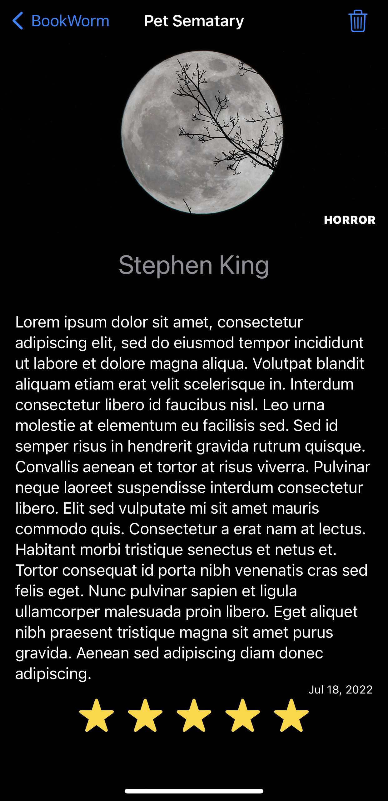

# Bookworm
100 Days of swiftui Project 11

This project was focused around using CoreData in a project to record and display book reviews in a simple list.

 

All of the challenges from the Project are implemented, feel free to look at the solutions I arrived at and implement them for yourself, just remember to learn!
